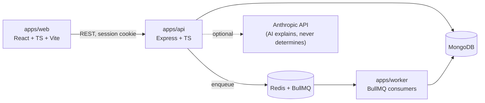
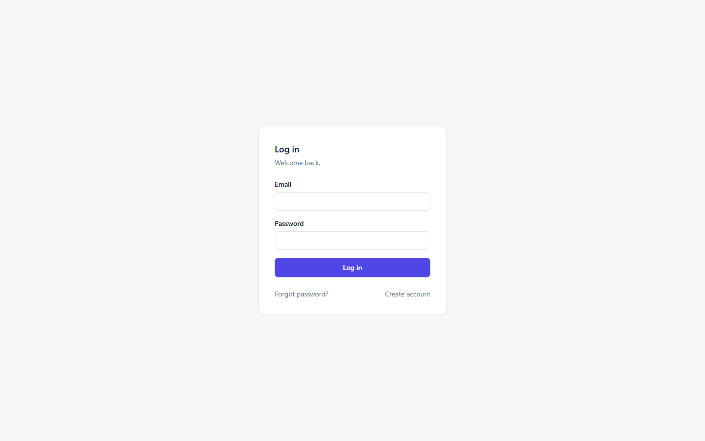
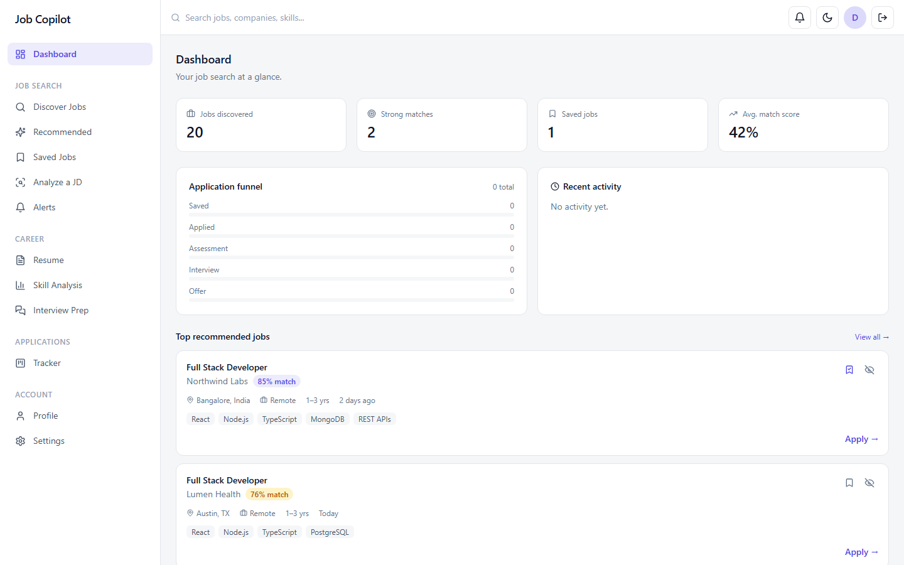
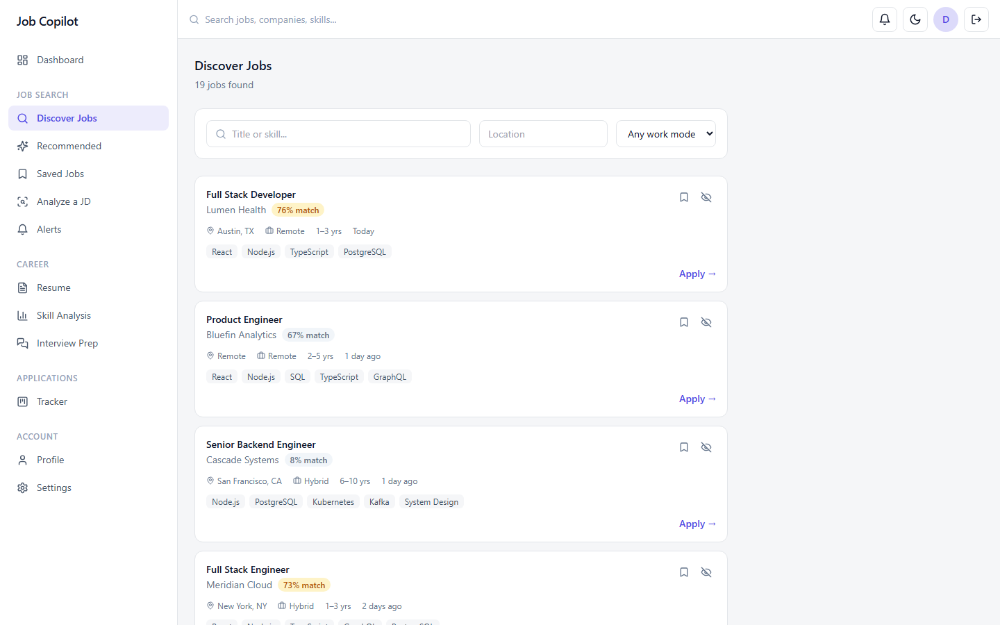
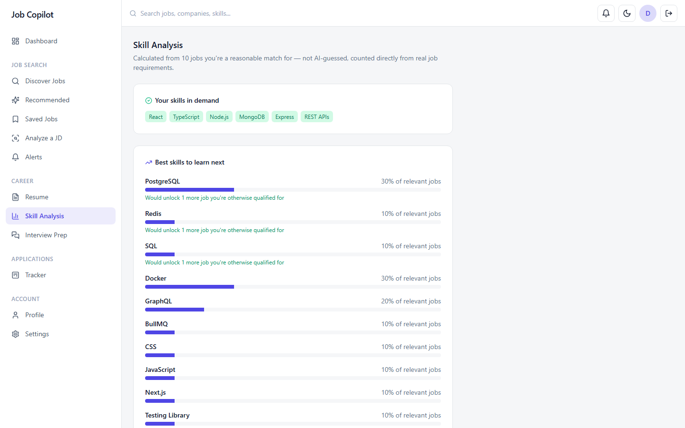
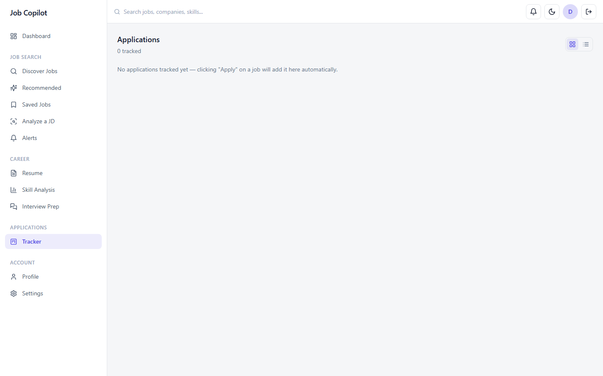

# Job Copilot

An AI-assisted job search platform built around a deterministic, explainable matching engine — with an AI layer designed in, not bolted on.

[](https://github.com/jaimaheshwari1706/job-copilot/actions/workflows/ci.yml)


## Overview

A full job-search assistant: profile/resume management, job ingestion and
search, match scoring, an application tracker, skill-gap analysis, interview
prep, alerts, and a career dashboard. Built phase-by-phase against a
written architecture plan — currently through **Phase 13 of 14** (Phase 14,
production hardening, is next). The complete phase-by-phase build log,
including bugs found and fixed and every phase's exact verified test count,
lives in [`docs/development-log.md`](docs/development-log.md).

## Problem

Most "AI-powered" job matchers are one opaque model call. This one scores
explainably *before* AI is involved at all: six independently deterministic,
unit-tested scorers (skills, experience, role, preferences, projects,
education) produce a match with structured, inspectable evidence — never a
bare number. AI is a swappable provider interface that adds explanation on
top of a system that already works without it, not a hidden dependency the
system needs to function.

## Architecture



**11 workspaces**, dependency rule enforced by directory structure — `api`
and `worker` both depend on `packages/*`, but never on each other:

```
apps/    web (React+TS+Vite+Tailwind) · api (HTTP transport only,
         no business logic) · worker (BullMQ consumers, HTTP-independent)
packages/  shared (Zod schemas/types) · db (Mongo models) ·
           queue (typed BullMQ contracts) · domain (matching engine,
           alerts, skill gap — pure logic) · ai (LLMProvider /
           AnthropicProvider) · jobs (provider abstraction, dedup) ·
           storage (local-disk + HMAC-signed URLs) · config (shared
           lint/format config)
```

## Engineering Decisions

- **AI explains, never determines.** Every AI feature (JD analyzer, cover
  letters, mock interview, dashboard insight) runs the real deterministic
  logic first and only adds prose on top; when no API key is configured,
  routes return the genuinely useful non-AI result (or a clean 400), never
  a fake AI response.
- **Constraint penalties apply before the weighted match average**, not
  after — so a severe mismatch (e.g. 8 years required vs. 1 year actual)
  can't be masked by an otherwise-strong skills score. Required skills are
  weighted above preferred ones.
- **Every demand/gap number in Skill Intelligence is counted directly from
  real job data**, never AI-estimated — including the "jobs unlocked per
  missing skill" calculation, which only counts a job as unlocked when that
  skill is the *sole* remaining gap.
- **`confidence` is a required field on every AI interview evaluation**,
  enforced at the schema level — subjective AI judgment is never presented
  with implied, unearned precision.

## Trade-offs

- **Recommendations compute-or-fetch-cached a match for every active job**
  (capped at 200) per request, reusing the matching engine's cache with
  zero new infrastructure. Documented as the right choice at this project's
  scale — real job-board volume would need this moved to a
  background-precomputed batch, not built speculatively without a concrete
  trigger design.
- **Internal packages run as TypeScript source via `tsx`**, not compiled to
  `dist`, in both dev and "production." Simpler for a monorepo this size
  (no dist/source resolution mismatch across `tsc`/`vitest`/runtime); would
  need a real build + `exports` map if any package is ever published
  independently.
- **Skills stay embedded on `Profile`/`Job`** rather than a normalized
  `candidateSkills` join collection — avoided reworking Phase 3's data model
  for integrity Phase 10's analytics didn't actually need yet.
- **One demo job provider, not a live job-board integration.** Keeps the
  ingestion pipeline (dedup, scheduling, normalization) fully real and
  testable without depending on a third party's API or ToS.

## Testing

```bash
npm run typecheck   # all 10 typed workspaces
npm run lint         # api, web, worker
npm run test         # api, web, worker, and every package
npm run build        # packages (dependency order), then apps
```

**183 tests, verified passing** across every workspace:

| Workspace | Tests | Covers |
|---|---|---|
| `api` | 64 | Auth, RBAC-style route guards, jobs, matches, skills, alerts, dashboard, interviews, applications, resume, AI routes (real code path, "not configured" state) |
| `domain` | 57 | Matching pipeline (17 fixture scenarios: exact match, missing skill, JS≠TS, under/overqualified, remote conflict, score bounds), skill-gap analysis, alert matching, daily brief |
| `web` | 6 | Auth guard redirects, route smoke tests |
| `jobs` | 10 | Duplicate-confidence scorer (exact/repost/different-company/different-role fixtures) |
| `shared` | 19 | Zod schema validation (application, interview, profile) |
| `storage` | 11 | Real local file I/O (save/read/delete/path-traversal-guard), signed-URL round-trip/tamper/expiry |
| `ai` | 14 | `AnthropicProvider` via injected fake `fetch`, including the repair-retry path |
| `worker` | 2 | Health-ping processor |

Route-level tests sign real JWTs and hit actual service logic against a
real MongoDB connection — not mocked. See
[`docs/development-log.md`](docs/development-log.md) for the exact
per-phase test count as the project grew (34 → 183) and for two real bugs
found and fixed along the way (a signed-URL route ordering bug, and a
Docker Compose env-var passthrough bug).

## Screenshots

**Login**


**Dashboard**


**Discover Jobs** — match scores computed live by the deterministic engine


**Skill Analysis**


**Application Tracker**


## Getting Started

**Prerequisites:** Node.js 20+, MongoDB, Redis (Docker Compose gives you
both without installing either).

```bash
npm install
cp apps/api/.env.example apps/api/.env
cp apps/worker/.env.example apps/worker/.env
cp apps/web/.env.example apps/web/.env
```

**Important:** replace `JWT_ACCESS_SECRET` and `SIGNED_URL_SECRET` in
`apps/api/.env` with real random 32+ character values before running
anything beyond local dev.

**AI features (optional):** set `ANTHROPIC_API_KEY` in `apps/api/.env` to
enable AI commentary/cover letters/mock interview. Leave it unset to run
fully otherwise — those routes return a clear "not configured" state.

### Option A — Docker Compose (recommended)

```bash
cd docker && docker compose up --build
```
- web: http://localhost:5173 · api: http://localhost:4000
- Visit `/system-health` to watch the full chain live: api → Mongo,
  api → Redis, api → BullMQ → worker → Mongo.

### Option B — Run natively (your own Mongo + Redis)

```bash
npm run dev:api     # terminal 1
npm run dev:worker  # terminal 2
npm run dev:web     # terminal 3
```

### Seed demo data

```bash
npm run seed -w @job-copilot/api
```

Idempotent, safe to re-run. Seeds the skill dictionary, runs a real
ingestion pass against the demo job provider, and creates a demo account
with a *deliberately partial* skill match, so match scores in the UI show a
genuine spread instead of every job scoring identically:

```
email:    demo@jobcopilot.dev
password: DemoPassword123!
```

## Project Structure

```
apps/api      Express — routes, services, no business logic (delegates to packages/domain)
apps/web      React + Vite + Tailwind, feature-sliced
apps/worker   BullMQ consumers — HTTP-independent
packages/*    shared, db, queue, domain, ai, jobs, storage, config (see Architecture)
docker/       Dockerfiles + docker-compose.yml for the full stack
docs/         development-log.md (full phase history), screenshots/
```

## Future Improvements / Roadmap

- **Phase 14 (next, per the original plan):** security review pass, a
  performance pass, Docker/CI-readiness verification, accessibility and
  dark-mode review across every page, and closing docs
  (`docs/architecture.md`, `docs/api.md`, `docs/ai-system.md`,
  `docs/matching-engine.md`).
- **Live AI calls to `api.anthropic.com` are still genuinely untested** —
  every `AnthropicProvider` test uses an injected fake `fetch`. Verify with
  a real `ANTHROPIC_API_KEY` before relying on the AI features in front of
  anyone.
- Recommendations' per-request compute-or-cache pattern (see Trade-offs)
  would need to move to a precomputed batch at real job-board volume.
- Dependency advisories currently open, tracked rather than force-upgraded:
  `esbuild`/`vite` (moderate, fix requires a breaking `vite@8` bump) and
  `react-router` (moderate open-redirect/SSR-hydration advisories — `npm
  audit fix` reports a fix but doesn't actually move the resolved version
  in this workspace setup; needs a manual version bump and re-test).
- One `TODO` tracked in code, not silently left: `auth.service.ts` — the
  password-reset flow logs the reset token instead of emailing it, pending
  an actual email-provider integration.

## License

Not yet licensed — no `LICENSE` file exists in this repository, so all
rights are reserved by default (`package.json` reflects this as
`"license": "UNLICENSED"`).

## Learn More

- [GitHub](https://github.com/jaimaheshwari1706)
